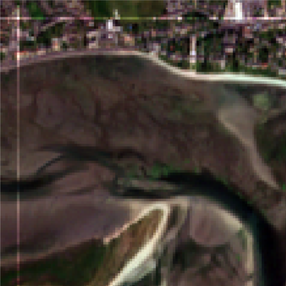
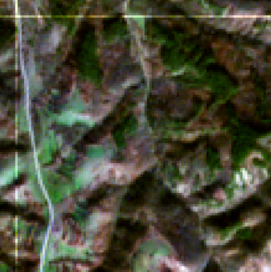
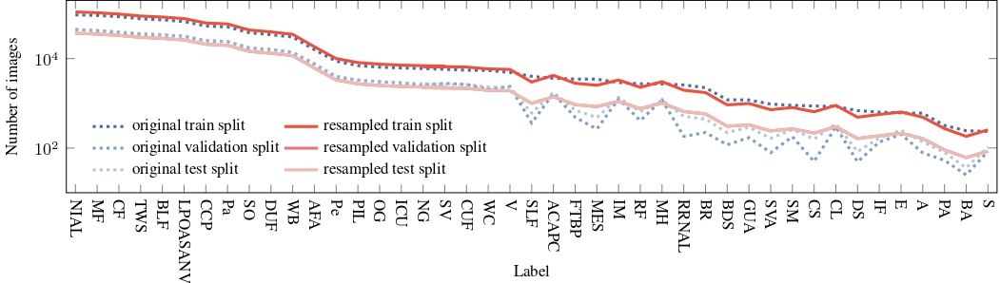

# Implementation on PyTorch for deep learning models on the BigEarthNet dataset

This repository contains the code for to train deep learning models on the BigEarthNet dataset [[1]](#1).

**WORK IN PROGRESS**

## Repository structure

```bash
.
├── data
│   ├── data_labels_bin.csv
│   ├── original
│   │   ├── test.csv
│   │   ├── train.csv
│   │   └── val.csv
│   └── resampled
│       ├── test.csv
│       ├── train.csv
│       └── val.csv
├── doc
│   └── split_label_distribution.jpg
├── environment.yml
├── LICENCE
├── README.md
├── sets.json
├── src
│   ├── BigEarthNet.py
│   ├── data_pretreatment
│   │   ├── label_indices.json
│   │   ├── prep_splits.py
│   │   ├── stratified_split.py
│   │   └── tensorflow_utils.py
│   ├── models
│   │   ├── InceptionV1.py
│   │   ├── InceptionV3.py
│   │   ├── ShortCNN_All.py
│   │   └── ShortCNN_RGB.py
│   └── read_event.py
└── train.py
```

## Installation

### Data download
Data description and download link are available on this [https://bigearth.net/v1.0.html](link).

**Warning:** ~66GB are required to store the data

### Dependencies

Python 3.8.19, PyTorch 2.0.1, Tensorflow 2.13.1, iterative-stratification 0.1.9 [[2]](#2)
```bash
conda env create -f environment.yml
conda activate balanced-bigearthnet
```

## Usage

| File | Associated command | Description |
| ---- | ------------------ | ----------- |
| prep_splits.py  | `prep_splits.py [-h] [-r ROOT_FOLDER] [-o OUT_FOLDER] [-n PATCH_NAMES [PATCH_NAMES ...]]` | Creates the TFRecord files containing the data and used in the training file |
| stratified_split.py  | `stratified_split.py [-h] [-d DATA_FILE] [-k NUMBER OF SPLITS] [-o OUTPUT_FOLDER] [-r ROOT_FOLDER] [-tf]` | Creates balanced splits to create the TFRecord files |
| train.py  | `train.py [-h] [--sets JSON_PATH_WITH_TFRECORD_PATHS] [--epochs NUMBER_OF_EPOCHS] [--optim OPTIIMIZER_USED] [--lr FLOAT_LEARNING_RATE] [--loss LOSS_FUNCTION] [--batch BATCH_SIZE] [--finetune FINETUNING_LEVEL] [--seed RANDOM_SEED] [--storage_path EVENT_STORAGE_PATH] [--count] [--rgb]` | Trains your model using the the TFRecord files |
| read_event.py  | `src/read_event.py [-h] [--storage_path EVENT_STORAGE_PATH]` | Plots your results after training using the training event file created |


To **create the TFRecord files** containing the data and used in the training file, use the file `prep_splits.py` made by G. Sumbul et al. [[1]](#1)
```bash
prep_splits.py [-h] [-r ROOT_FOLDER] [-o OUT_FOLDER] [-n PATCH_NAMES [PATCH_NAMES ...]]
```

To **create balanced splits** to create the TFRecord files, use the file `stratified_split.py`. 
**Warning:** each splits created will be the same size ! 
```bash
stratified_split.py [-h] [-d DATA_FILE] [-k NUMBER OF SPLITS] [-o OUTPUT_FOLDER] [-r ROOT_FOLDER] [-tf]
```

To **train your model** using the the TFRecord files, use the file `train.py`.
```bash
train.py [-h] [--sets JSON_PATH_WITH_TFRECORD_PATHS] [--epochs NUMBER_OF_EPOCHS] [--optim OPTIIMIZER_USED] [--lr FLOAT_LEARNING_RATE] [--loss LOSS_FUNCTION] [--batch BATCH_SIZE] [--finetune FINETUNING_LEVEL] [--seed RANDOM_SEED] [--storage_path EVENT_STORAGE_PATH] [--count] [--rgb]
```

To **plot your results** after training using the training event file created, use the file `read_event.py`.
```bash
src/read_event.py [-h] [--storage_path EVENT_STORAGE_PATH]
```

Example:
```bash
stratified_split.py -d data/data_labels_bin.csv -k 5 -o data/resampled -r BigEarthNet-S2-v1.0/BigEarthNet-v1.0

cat data/resampled/fold_0.csv data/resampled/fold_1.csv data/resampled/fold_2.csv > data/resampled/train.csv
mv data/resampled/fold_3.csv data/resampled/val.csv
mv data/resampled/fold_4.csv data/resampled/test.csv

prep_splits.py -r BigEarthNet-S2-v1.0/BigEarthNet-v1.0 -o results -n data/resampled/train.csv data/resampled/val.csv data/resampled/test.csv
train.py --sets sets.json --epochs 100 --optim SGD --lr 0.001 --loss BCEWithLogits --batch 300 --finetune 0 --seed 1 --storage_path results --count --rgb
```

## Dataset description

<table>
  <tr>
    <td></td>
    <td>Discontinuous urban fabric <br> Beaches, dunes, sands <br> Salt marches <br> Intertidal flats <br> Estuaries</td>
  </tr>
  <tr>
    <td></td>
    <td>Pastures <br> Broad-leaved forest <br> Mixed forest <br> Natural grassland <br> Transitional woodland/shrub</td>
  </tr>
 </table>



| Acronym  | Label |
|----------|-------|
| NIAL     | Non-irrigated arable land |
| MF       | Mixed forest |
| CF       | Coniferous forest |
| TWS      | Transitional woodland/shrub |
| BLF      | Broad-leaved forest |
| LPOASANV | Land principally occupied by agriculture, with significant areas of natural vegetation |
| CCP      | Complex cultivation patterns |
| Pa       | Pastures |
| SO       | Sea and ocean |
| DUF      | Discontinuous urban fabric |
| WB       | Water bodies |
| AFA      | Agro-forestry areas |
| Pe       | Peatbogs |
| PIL      | Permanently irrigated land |
| OG       | Olive groves |
| ICU      | Industrial or commercial units |
| NG       | Natural grassland |
| SV       | Sclerophyllous vegetation |
| CUF      | Continuous urban fabric |
| WC       | Water courses |
| V        | Vineyards |
| SLF      | Sport and leisure facilities |
| ACAPC    | Annual crops associated with permanent crops |
| FTBP     | Fruit trees and berry plantations |
| MES      | Mineral extraction sites |
| IM       | Inland marshes |
| RF       | Rice fields |
| MH       | Moors and heathland |
| RRNAL    | Road and rail networks and associated land |
| BR       | Bare rock |
| BDS      | Beaches, dunes, sands |
| GUA      | Green urban areas |
| SVA      | Sparsely vegetated areas |
| SM       | Salt marshes |
| CS       | Construction sites |
| CL       | Coastal lagoons |
| DS       | Dump sites |
| IF       | Intertidal flats |
| E        | Estuaries |
| A        | Airports |
| PA       | Port areas |
| S        | Salines |
| BA       | Burnt areas |

## Authors

* [Matthieu Verlynde](https://github.com/MattVerlynde) ([matthieu.verlynde@univ-smb.fr](mailto:matthieu.verlynde@univ-smb.fr))
* [Ammar Mian](https://ammarmian.github.io/) ([ammar.mian@univ-smb.fr](mailto:ammar.mian@univ-smb.fr))
* [Yajing Yan](https://www.univ-smb.fr/listic/en/presentation_listic/membres/enseignants-chercheurs/yajing-yan-fr/) ([yajing.yan@univ-smb.fr](mailto:yajing.yan@univ-smb.fr))

## References
>  <a id="1">[1]</a>  G. Sumbul, M. Charfuelan, B. Demir, V. Markl, “[BigEarthNet: A Large-Scale Benchmark Archive for Remote Sensing Image Understanding](https://bigearth.net/static/documents/BigEarthNet_IGARSS_2019.pdf)”, IEEE International Geoscience and Remote Sensing Symposium, pp. 5901-5904, Yokohama, Japan, 2019.<br>
>  <a id="2">[2]</a>  C. Sechidis, G. Tsoumakas, I. Vlahavas, “[On the stratification of multi-label data](https://link.springer.com/chapter/10.1007/978-3-642-23808-6_10)” Machine Learning and Knowledge Discovery in Databases, D. Gunopulos, T. Hofmann, D. Malerba, and M. Vazirgiannis, Eds., Berlin, Heidelberg, 2011, pp. 145–158, Springer Berlin Heidelberg.